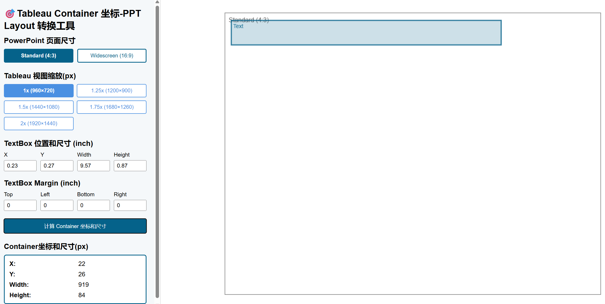

本工具将 PowerPoint 中文本框的位置与尺寸（单位：inch）转换为 Tableau 中容器的像素坐标与尺寸，辅助精确布局 Tableau Dashboard 中的 Floating Container。

## ✨ 功能 Features
- 支持 PowerPoint 页面尺寸选择：Standard (4:3), Widescreen (16:9)
- 预设多种 Tableau 缩放比例
- 输入文本框的 X, Y, Width, Height 和 Margin（单位：inch）
- 输出容器的 X, Y, Width, Height（单位：px）
- 可视化预览 Box 位置，便于调整

## 🛠️ 使用方法 How to Use
- 在线使用（GitHub Pages）：[https://yvonnej18.github.io/tableau-tools/]
- 本地打开：双击 `convert.html` 直接使用，无需服务器

## 🚀 部署到 GitHub Pages
```bash
git init
git add .
git commit -m "init"
git branch -M main
git remote add origin https://github.com/你的用户名/你的仓库名.git
git push -u origin main

# 启用 GitHub Pages：设置 → Pages → Source: main branch → /root
```
🖼️ 页面截图


## 🧩 文件结构 File Structure
```
├── index.html
├── style.css
├── script.js
└── README.md
```

🙋‍♀️ 作者
Created by Yvonne Jin

MIT License. 欢迎修改分享。